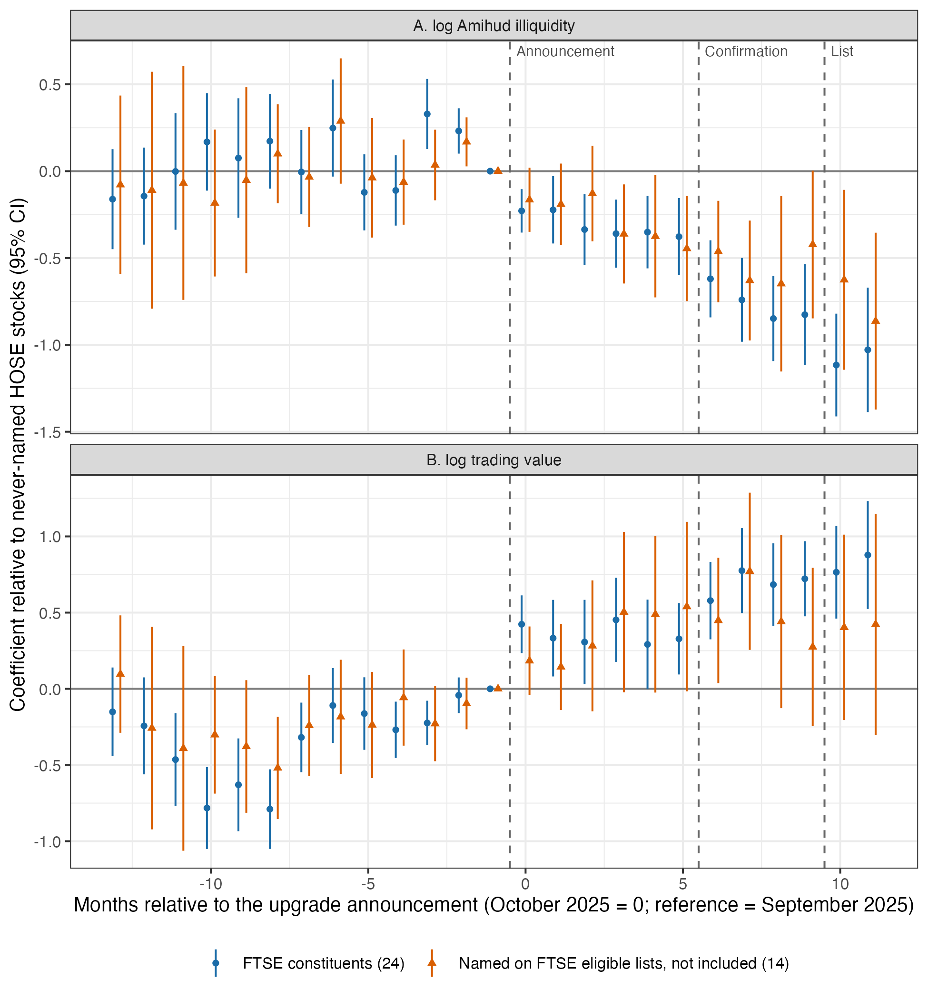

# Who gains from a market upgrade? Stock liquidity and prices around Vietnam's FTSE Russell reclassification

## Abstract

FTSE Russell reclassified Vietnam from frontier to secondary emerging status in four public steps between October 2025 and September 2026. Using daily data on 366 stocks listed on the Ho Chi Minh City Stock Exchange, we compare the 24 index constituents with all other listed stocks at each step. Constituents' Amihud illiquidity fell by 59% relative to other stocks after FTSE confirmed the upgrade and by 67% once it published the constituent list; the 32% decline after the first announcement weakens under the strictest specification. Controlling for volatility, which rose for constituents, enlarges these effects. Constituents also earned abnormal returns of 3.3%, 4.5% and 2.6% around the announcement, confirmation and constituent list; the confirmation gain persisted over the following month. The effective date brought no price reaction, only a one-session trading surge at rebalancing that rose with index weight. Stocks that FTSE named as eligible but excluded show mixed evidence: two of them gained liquidity before they were named, which indicates that FTSE's selection partly follows rising liquidity. Vietnam's upgrade delivered its liquidity and price gains at disclosure, months before index funds traded.

**Keywords**: market reclassification; index effect; stock liquidity; frontier markets; event study; Vietnam

**JEL classification**: G12; G14; G15

## 1. Introduction

A market upgrade delivered its liquidity gains to index constituents months before any index fund traded. When FTSE Russell reclassified Vietnam from frontier to secondary emerging status, the Amihud (2002) illiquidity of the stocks it would include fell relative to other stocks on the Ho Chi Minh City Stock Exchange (HOSE) at each public step: by 59% after FTSE confirmed the upgrade in April 2026 and by 67% after it named the constituents in August 2026. Constituents also earned abnormal returns of 3% to 5% around each of these disclosures. On the effective date itself, prices did not move; the only trace of index membership was a one-session trading surge at the rebalancing close.

Market classification decides which benchmarks a country's stocks can enter, and benchmark weights steer international portfolio allocations (Raddatz et al., 2017). An upgrade from frontier to emerging status therefore promises new foreign demand, and Vietnamese policymakers pursued it through seven years of watch-list reviews. Whether the promised liquidity reaches individual stocks, which stocks it reaches, and when, bears on issuers' cost of capital, because liquidity is priced in emerging markets (Bekaert et al., 2007).

Existing evidence answers these questions poorly for frontier markets. In developed markets, additions to the S&P 500 raise trading activity and narrow spreads for years (Hegde & McDermott, 2003), and added firms with larger liquidity gains invest more (Becker-Blease & Paul, 2006). In frontier markets, index additions raise prices persistently, and the evidence points to institutional demand rather than trading pressure or liquidity changes as the cause (Biktimirov & Afego, 2026). Most studies of market reclassification also work with aggregate indices or country-level flows, which cannot separate the stocks an upgrade targets from market-wide trends. An earlier study of the same market by the present authors (anonymized for review) found that FTSE watch-list reviews did not coincide with structural breaks in index-level liquidity; that design could not ask which stocks gained.

Vietnam's reclassification offers a cleaner test for three reasons. FTSE Russell disclosed the decision in four dated steps: the announcement on 7 October 2025, the confirmation on 7 April 2026, the constituent list on 21 August 2026, and the effective date of 21 September 2026. Each step resolved a different piece of uncertainty, so their separate effects reveal when investors acted. Hundreds of HOSE stocks outside the index trade under the same rules, hours and price limits and provide a comparison group. FTSE also named stocks as eligible before choosing the constituents, which lets us ask whether its selection followed liquidity that was already rising.

We estimate difference-in-differences and event-study regressions on 35,752 stock-weeks and on daily returns from October 2024 to September 2026. The treated group contains the 24 constituents with a full pre-period; the controls are 337 other HOSE stocks, and a matched subsample pairs each constituent with three controls of similar pre-period trading value, price and volatility (Ho et al., 2007). The main liquidity measure is the Amihud ratio computed on traded value in Vietnamese dong; we also report trading value, the Corwin and Schultz (2012) high-low spread, volatility and abnormal returns.

The paper makes one contribution: it decomposes the stock-level liquidity and price effects of a frontier-to-emerging reclassification by disclosure stage. Four findings support the decomposition. First, constituents' illiquidity fell by 0.39, 0.88 and 1.12 log points across the announcement, confirmation and constituent-list windows (Table 2), with no pre-announcement drift (Figure 1) and with randomization-inference p-values below 0.002. Second, prices moved at each disclosure and not at the effective date, and only the confirmation gain persisted (Table 3). Third, the effective date produced a trading-value surge of 0.80 log points on the rebalancing session (t = 4.87), which rose with FTSE size segment (Tables 4 and 5). Fourth, stocks named as eligible but excluded offer a selection test: two of them became more liquid before FTSE named them, so part of the eligibility screen reflects rising liquidity (Table 8). This last result sets a limit on causal readings and motivates the specifications with constituent-specific trends.

Section 2 describes the setting, reviews the literature and states the hypotheses. Section 3 presents the data and design. Section 4 reports the results, Section 5 the robustness checks and the selection evidence, and Section 6 concludes.

## 2. Setting, literature and hypotheses

### 2.1 FTSE Russell's four-step reclassification of Vietnam

FTSE Russell added Vietnam to its watch list for possible reclassification in September 2018 (FTSE Russell, 2018). On 7 October 2025 it announced that Vietnam would move from frontier to secondary emerging status with effect from 21 September 2026, subject to an interim review in March 2026 (LSEG, 2025). On 7 April 2026 it confirmed that Vietnam met all criteria for secondary emerging status and kept the effective date (LSEG, 2026). Inclusion is phased in four tranches that add 10%, 20%, 35% and 35% of the applicable index weight on 21 September 2026, 22 March 2027, 21 June 2027 and 20 September 2027 (FTSE Russell, 2026). Between these dates the financial press reported FTSE's lists of eligible stocks: a preliminary list of 28 names in November 2025 (Viet Nam News, 2025) and a list of 32 eligible stocks in April 2026 (The Investor, 2026). On Friday 21 August 2026 FTSE published the September semi-annual review with the 27 constituents, effective after the close of 18 September 2026 (FTSE Russell, 2026; VIR, 2026).

The four steps carried different information. The announcement told investors that Vietnamese stocks would become eligible for emerging-market benchmarks but made the upgrade conditional on an interim review. The confirmation removed that condition. The constituent list named the stocks index-tracking funds would buy, and the rebalancing session was the day they had to buy them. Effects that appear at the early disclosures indicate that investors traded on information; effects concentrated at the rebalancing session indicate mechanical index demand.

### 2.2 Index inclusion and liquidity

Two channels link index membership to liquidity and prices. The price-pressure channel works through the trades of index funds: additions force passive funds to buy on the effective date, which produces temporary volume and price effects that reverse afterwards (Harris & Gurel, 1986). The demand and recognition channel works through a lasting change in the investor base. Shleifer (1986) interprets permanent price effects as evidence that demand curves for stocks slope down, and Chen et al. (2004) find asymmetric effects of additions and deletions that fit a gain in investor awareness. Hegde and McDermott (2003) show that S&P 500 additions narrow spreads and raise trading activity persistently, which they attribute to more information and more trading interest.

Liquidity gains from inclusion also have real consequences. Becker-Blease and Paul (2006) find that firms added to the S&P 500 with larger liquidity improvements increase capital investment, and Gregoriou and Nguyen (2010) find the mirror pattern for FTSE 100 deletions. Liquidity co-moves across stocks (Chordia et al., 2000), so any study of these effects must separate stock-specific changes from market-wide liquidity shocks.

### 2.3 Market reclassification and frontier markets

Reclassification moves a whole market between benchmark families. Mutual funds allocate across countries with reference to benchmark weights, so a change in classification changes capital flows (Raddatz et al., 2017), and an MSCI index change even moved currency values through this channel (Hau et al., 2010). When MSCI included China A-shares in its Emerging Markets Index, the included stocks earned abnormal returns around the announcement, and market quality changed over the longer run through liquidity, turnover and price synchronization (Dong et al., 2023). The frontier-market evidence is weaker. Biktimirov and Afego (2026) study changes to the FTSE Frontier 50 Index from 2008 to 2025. Additions earn persistent price gains, country reclassification events show distinct return and volume effects, and the authors attribute the gains to institutional demand rather than to trading pressure or liquidity. Our design complements theirs: it follows liquidity stage by stage and compares index stocks with non-index stocks of the same market. No study we know of, in a search bounded to Crossref records and the literature cited here, estimates the stock-level liquidity effect of a frontier-to-emerging reclassification with a comparison group.

Liquidity carries particular weight in these markets. Bekaert et al. (2007) show that local market liquidity predicts returns in emerging markets, where segmentation from global capital is only partial, and Stereńczak et al. (2020) ask whether frontier-market investors demand compensation for illiquidity. A reclassification that improves liquidity for a subset of stocks could therefore shift their cost of capital relative to the rest of the market. Frontier markets also differ from developed ones in who trades: when domestic retail investors dominate turnover, the arrival of benchmark-tracking foreign money is a larger change in the investor base than an S&P 500 addition, and the recognition channel has more room to operate. The Vietnamese evidence available before the upgrade concerns market-wide liquidity shocks rather than classification events; for example, Nguyen et al. (2021) study the returns and liquidity of financial-services stocks during the COVID-19 outbreak.

### 2.4 Hypotheses

The recognition channel predicts that liquidity and prices respond when information reaches investors; the price-pressure channel predicts a trading and price spike when index funds rebalance, followed by reversal.

H1. After the reclassification announcement, index constituents became less illiquid than other HOSE stocks.

H2. The liquidity gap widened as each later disclosure resolved uncertainty about the upgrade and its constituents.

H3. Constituents earned abnormal returns at the disclosures, and the effective date added no further price effect.

H4. The rebalancing session produced a trading-value surge for constituents that scaled with index weight.

## 3. Data and empirical design

### 3.1 Sample

We collect daily open, high, low and close prices and share volume for all 405 common stocks listed on HOSE as of 24 September 2026, from 1 October 2024 to 23 September 2026. The data come from the VCI feed through the open-source vnstock library. We keep stocks with at least 200 trading days before 7 October 2025, zero volume on fewer than 20% of those days, and a median price of at least VND 1,000. Three constituents listed after October 2025 (TCX, VPL and VCK) fail the pre-period requirement, which leaves 24 constituents. Five stocks that press reports of FTSE's eligibility lists named but the final list excluded (SAB, DXG, GEE, BSR and PLX) form a separate near-miss group, which we exclude from the control group and use for the selection tests in Section 5. The remaining 337 stocks form the control group, for 366 stocks in total.

Table 1 shows that constituents are much larger and more liquid than the average HOSE stock. Before the announcement, constituents traded a mean of 6.82 log VND billion per week against 2.30 for control stocks, and their mean weekly Amihud ratio was about three orders of magnitude lower. Near-miss stocks sit between the two groups. Spreads and absolute returns are similar across groups. The size gap motivates the matched sample and the size-specific checks below.

**Table 1. Sample composition and pre-announcement characteristics (October 2024 to 6 October 2025)**

| Group | Stocks | Stock-weeks | Mean weekly Amihud | Mean log trading value (VND bn) | Mean CS spread (%) | Mean absolute return (%) |
|---|---|---|---|---|---|---|
| FTSE constituents | 24 | 1,248 | 0.00017 | 6.82 | 0.57 | 1.40 |
| Near-miss eligible | 5 | 258 | 0.0089 | 5.45 | 0.60 | 1.59 |
| Other HOSE stocks | 337 | 17,383 | 0.19 | 2.30 | 0.61 | 1.37 |

*Notes*: Amihud is the mean daily ratio of absolute log return to traded value (VND billion) within a week. CS is the Corwin and Schultz (2012) spread. Source: authors' calculations (output/table1b_descriptives_by_group.csv).

### 3.2 Liquidity and return measures

Daily traded value equals the closing price times share volume, in VND billion. The Amihud (2002) ratio for stock i on day t is

ILLIQ_it = |R_it| / VAL_it,

where R_it is the log return and VAL_it the traded value. Traded value, rather than share volume, makes the ratio comparable across stocks with different price levels. We compute the Corwin and Schultz (2012) spread from two-day high and low prices and set negative estimates to zero. We winsorize the daily Amihud ratio and spread cross-sectionally at the 1st and 99th percentiles of each day and aggregate to a stock-week panel, keeping weeks with at least three trading days and a positive Amihud ratio. Weekly Amihud is the mean of daily ratios, used in logs; weekly trading value is the log of total traded value; the weekly spread is the mean daily spread; weekly volatility is the log of the mean absolute daily return. Kang and Zhang (2014) show that the Amihud ratio loses accuracy in emerging markets where many days have zero volume, and propose an adjustment; our filter removes stocks with zero volume on 20% or more of pre-period days, which limits this problem.

For prices, the daily abnormal return of stock i is its log return minus the equal-weighted mean log return of the 337 control stocks on the same day. Cumulative abnormal returns (CARs) sum these over event windows around each disclosure, and t-statistics come from the cross-section of constituents.

### 3.3 Estimation

The baseline liquidity specification is

y_iw = α_i + λ_w + Σ_k β_k (Constituent_i × P_kw) + ε_iw,

where y_iw is a liquidity measure for stock i in week w, α_i and λ_w are stock and week fixed effects, and P_1, P_2 and P_3 indicate the announcement window (7 October 2025 to 6 April 2026), the confirmation window (7 April to 20 August 2026) and the list-and-rebalancing window (21 August to 23 September 2026). Weeks start on Monday, and a week enters a window only if it starts on or after the disclosure date, so each window begins with the first full week after the disclosure. FTSE does not state the hour at which it released the constituent list; the weekly assignment and the [-1,+1] event window, which spans 20, 21 and 24 August, both contain the first Vietnamese session after the release. Week fixed effects absorb market-wide shocks, including monetary conditions and the rally that accompanied the upgrade. We cluster standard errors by stock.

Constituents are the largest HOSE stocks, so shocks that affect large stocks differently could bias the comparison. We address this threat in five ways. We re-estimate on a matched sample that pairs each constituent with three control stocks by nearest-neighbour propensity score, with replacement, on pre-period traded value, price and return volatility (Ho et al., 2007); matching reduces the standardized mean difference in pre-period traded value from 3.97 to 0.07. We replace week fixed effects with size-tercile-by-week fixed effects. We estimate a monthly event study relative to September 2025 and test whether the pre-period coefficients are jointly zero (Roth et al., 2023). We add a constituent-specific linear trend. Finally, randomization inference draws 500 pseudo-treated groups of 24 stocks from the 94 control stocks in the top tercile of pre-period trading value and compares the observed coefficients with the placebo distribution. Because FTSE treated all constituents at the same dates, the specification has no staggered adoption, and the two-way fixed effects estimator does not suffer the negative-weighting problem that motivates Callaway and Sant'Anna (2021).

For the rebalancing session we estimate a daily regression of log traded value on stock and date fixed effects and constituent-by-session interactions around 18 September 2026, with the last session before the constituent list as the reference day, on constituents and their matched controls.

### 3.4 Identification assumptions

The coefficients β_k measure the change in constituents' liquidity relative to control stocks. They identify the effect of the upgrade on constituents under four assumptions.

First, parallel trends: without the upgrade, constituents and control stocks would have followed the same liquidity path. The event study tests the observable implication for the twelve pre-announcement months, and the size-by-week, matched and trend specifications relax it in different directions.

Second, no anticipation before 7 October 2025. Vietnam sat on the FTSE watch list for seven years (FTSE Russell, 2018), so investors could have bought likely constituents in advance of the decision. Anticipation of this kind would raise liquidity before the announcement and bias the estimates toward zero. The event study shows no such pre-announcement improvement in the Amihud ratio.

Third, no spillovers onto control stocks. If investors sold control stocks to buy constituents, the control group's liquidity would fall because of the treatment, and the estimate would combine a gain for constituents with a loss for the rest. Section 5 examines this concern. Under either reading, the estimate measures how the upgrade redistributed liquidity toward constituents, the quantity that matters for issuers and regulators.

Fourth, the treatment group must not be selected on post-treatment outcomes. FTSE chose the constituents in August 2026, on data that include part of the treatment period, and its eligibility screens depend on size and liquidity. Constituents could therefore be stocks whose liquidity was already rising. Stock fixed effects absorb level differences, the event study checks for pre-existing trends, and the trend specification absorbs a linear version of this selection. Section 5 uses the near-miss stocks to measure how much selection on rising liquidity occurred.

## 4. Results

### 4.1 Constituents became less illiquid from the announcement onward

Constituents' Amihud illiquidity fell relative to other HOSE stocks in each disclosure window, and the fall deepened at each stage. Table 2, column 1, reports coefficients of -0.39, -0.88 and -1.12 log points, which correspond to declines of 32%, 59% and 67% relative to control stocks. All three are significant at the 0.1% level. The matched sample in column 4 gives -0.39, -0.71 and -0.98 (declines of 32%, 51% and 62%), so the result does not depend on comparing the largest stocks with the smallest.

**Table 2. Liquidity of FTSE constituents relative to control stocks, by disclosure stage**

| | (1) log Amihud | (2) log trading value | (3) CS spread | (4) log Amihud | (5) log trading value | (6) CS spread |
|---|---|---|---|---|---|---|
| Sample | All HOSE | All HOSE | All HOSE | Matched 3:1 | Matched 3:1 | Matched 3:1 |
| Constituent × Announcement | -0.391*** (0.098) | 0.671*** (0.108) | 0.0009** (0.0003) | -0.388** (0.134) | 0.544** (0.162) | 0.0005 (0.0004) |
| Constituent × Confirmation | -0.884*** (0.123) | 1.025*** (0.125) | 0.0010** (0.0003) | -0.712*** (0.179) | 0.893*** (0.193) | 0.0010* (0.0004) |
| Constituent × List and rebalancing | -1.120*** (0.178) | 1.189*** (0.168) | 0.0013* (0.0005) | -0.979*** (0.233) | 1.157*** (0.235) | 0.0011 (0.0006) |
| Stock and week FE | Yes | Yes | Yes | Yes | Yes | Yes |
| Observations | 35,259 | 35,259 | 35,259 | 5,146 | 5,146 | 5,146 |

*Notes*: Stock-week panel, October 2024 to September 2026; near-miss stocks excluded. Standard errors clustered by stock in parentheses. *, **, *** denote significance at 5%, 1% and 0.1%. Source: output/table2_did.csv.

Figure 1 shows the timing. In the twelve months before the announcement, the constituents' monthly Amihud coefficients fluctuate around zero; the joint test rejects equality to zero at the 5% level (F = 1.84, p = 0.037), driven by positive values two and three months before the announcement, which run against the later decline. The coefficient turns negative in October 2025 (-0.23) and falls steadily to -1.11 by August 2026. This pattern supports H1 and H2: illiquidity dropped when FTSE made the upgrade public and continued to fall as each later step resolved uncertainty about the outcome.

**Figure 1. Monthly event-study coefficients for FTSE constituents and near-miss eligible stocks**

*Note*: Coefficients relative to September 2025 from regressions with stock and week fixed effects; 95% confidence intervals from stock-clustered standard errors. Dashed lines mark the announcement, confirmation and constituent-list months. Near-miss stocks are discussed in Section 5.2. Source: output/table_event_study_two_groups.csv.

Trading value tells a similar story with one caveat. Constituents' trading value rose by 0.67, 1.03 and 1.19 log points relative to control stocks (Table 2, column 2). Unlike the Amihud ratio, trading value was already rising for constituents before October 2025 (Figure 1, panel B; joint pre-trend test p < 0.001), so part of this increase continues an earlier trend. Section 5 reports trend-adjusted estimates.

Randomization inference confirms that these declines are not what large HOSE stocks experienced in general. None of 500 pseudo-groups of 24 stocks drawn from the 94 largest control stocks produced a coefficient as negative as the observed one in any window (one-sided p < 0.002). The placebo distribution centres at -0.22 in the list window, so large non-constituents became somewhat more liquid too, but by one fifth of the constituent effect.

**Takeaway.** Constituents' illiquidity fell by about one third within months of the announcement and by two thirds by the constituent list, with no comparable movement beforehand.

### 4.2 Prices moved at each disclosure and not at the effective date

Constituents earned positive abnormal returns around each of the three disclosures that preceded the effective date. Table 3 reports cumulative abnormal returns of 3.3% over days -1 to +1 around the announcement (t = 6.4), 4.5% around the confirmation (t = 7.5) and 2.6% around the constituent list (t = 5.1). Around the effective date the three-day CAR was -0.2% (t = -0.2), and over days -1 to +5 it was -0.6% (t = -0.8). This pattern supports H3: prices responded to information, not to the date on which index funds bought.

**Table 3. Cumulative abnormal returns of FTSE constituents around FTSE disclosures**

| Event | Window | Constituents: CAR (t) | Near-miss: CAR (t) |
|---|---|---|---|
| Announcement, 7 Oct 2025 | [-1,+1] | 3.3% (6.40) | 1.4% (1.80) |
| | [-1,+5] | 7.6% (5.07) | 6.9% (1.39) |
| | [0,+20] | -2.4% (-0.82) | 8.6% (1.05) |
| Confirmation, 7 Apr 2026 | [-1,+1] | 4.5% (7.47) | 0.2% (0.14) |
| | [-1,+5] | 4.7% (4.80) | 0.1% (0.09) |
| | [0,+20] | 10.0% (3.68) | 4.3% (1.51) |
| Constituent list, 21 Aug 2026 | [-1,+1] | 2.6% (5.09) | 0.9% (0.66) |
| | [-1,+5] | 4.4% (5.09) | -0.8% (-0.34) |
| | [0,+20] | 4.6% (2.87) | 3.3% (0.80) |
| Effective date, 21 Sep 2026 | [-1,+1] | -0.2% (-0.23) | -0.3% (-0.22) |
| | [-1,+5] | -0.6% (-0.77) | 0.7% (0.31) |

*Notes*: Abnormal return = daily log return minus the equal-weighted mean log return of the 337 control stocks. t-statistics from the cross-section of 24 constituents and 5 near-miss stocks. The effective-date [0,+20] window is not available because the data end on 23 September 2026. Source: output/table8_car_events.csv.

The announcement and confirmation gains behaved differently afterwards. The announcement gain reversed within a month: the CAR over days 0 to +20 was -2.4% and not significant. The confirmation gain grew: over days 0 to +20 constituents earned 10.0% (t = 3.7). The reversal after the first, conditional announcement fits temporary price pressure (Harris & Gurel, 1986). The persistent gain after the confirmation, once the upgrade was certain and dated, fits a lasting shift in demand for the stocks (Shleifer, 1986; Chen et al., 2004). From the announcement to 23 September 2026, constituents accumulated an abnormal return of 14.6% (standard error 7.6%). Near-miss stocks show no significant abnormal return in any window.

**Takeaway.** The upgrade moved constituents' prices at each disclosure; the gain became lasting only once FTSE confirmed the upgrade, and the effective date added nothing.

### 4.3 The effective date added a one-session trading surge at rebalancing

The effective date left one trace. On 18 September 2026, the last session before the upgrade took effect, constituents' trading value rose 0.80 log points above matched controls (standard error 0.17, t = 4.87; Table 4, panel A), a 124% increase. In the 27 sessions before it, including the day FTSE published the constituent list, no coefficient differs from zero at the 5% level, and the effect vanishes after the effective date (0.23 on 21 September, not significant). Panel B shows raw abnormal trading value by group: constituents +0.76 log points, matched controls -0.20, and near-miss stocks +0.22 with a standard error of 0.33.

**Table 4. Trading value around the rebalancing session of 18 September 2026**

Panel A. Daily regression, constituents vs matched controls

| Session | Coefficient | Std. error | t |
|---|---|---|---|
| 16 Sep 2026 (t-2) | 0.032 | 0.161 | 0.20 |
| 17 Sep 2026 (t-1) | 0.123 | 0.164 | 0.75 |
| 18 Sep 2026 (rebalancing) | 0.805 | 0.165 | 4.87 |
| 21 Sep 2026 (effective date) | 0.226 | 0.164 | 1.38 |
| 22 Sep 2026 | -0.132 | 0.181 | -0.73 |
| 23 Sep 2026 | -0.134 | 0.207 | -0.65 |

Panel B. Mean abnormal log trading value on 18 September 2026 (relative to each stock's mean daily log trading value from 60 to 6 calendar days before the constituent list)

| Group | Mean | Std. error | Stocks |
|---|---|---|---|
| FTSE constituents | 0.760 | 0.124 | 24 |
| Near-miss eligible | 0.220 | 0.327 | 5 |
| Matched controls | -0.199 | 0.121 | 28 |

*Notes*: Panel A: stock and date fixed effects; reference day is the last session before 21 August 2026; standard errors clustered by stock; all 25 earlier session coefficients (not shown) have |t| < 1.2. Sources: output/table_rebalance_reg.csv, output/table5_rebalance_by_group.csv.

This surge is the signature of the price-pressure channel (Harris & Gurel, 1986): index funds tracking FTSE benchmarks had to buy constituents at the closing price of 18 September, and nothing obliged them to trade other stocks. Yet it moved volume, not prices: the three-day CAR around the effective date is zero (Table 3), consistent with active investors having bought the stocks earlier and supplying them to index funds at the close.

**Takeaway.** Index funds concentrated their demand in one session, and prices had already adjusted by then.

### 4.4 The gains and the rebalancing surge rise with FTSE size segment

FTSE assigned the constituents to size segments on 21 August 2026: three large-capitalization stocks (VCB, VIC, VHM), three mid-capitalization stocks (BID, VPB, HPG) and 18 small-capitalization stocks among those in our sample (VIR, 2026). Index weights, and therefore passive purchases, rise with capitalization, so the price-pressure channel predicts a larger rebalancing surge for large-capitalization constituents. Foreign allocations follow benchmark weights (Raddatz et al., 2017), which points the same way for the persistent effect.

Table 5 splits the constituent coefficients by segment. The fall in illiquidity is largest for the three large-capitalization stocks: -0.61, -1.35 and -2.19 log points across the three windows, compared with -0.20, -0.62 and -0.81 for mid-capitalization stocks and -0.39, -0.85 and -0.99 for small-capitalization stocks. The ordering between mid and small stocks does not follow size, and with three stocks in each of the two upper segments the segment estimates are imprecise. The rebalancing surge, in contrast, rises monotonically with segment: abnormal log trading value on 18 September 2026 averaged 1.23 for large-capitalization constituents, 0.98 for mid-capitalization and 0.65 for small-capitalization constituents. This supports H4.

**Table 5. Constituent effects by FTSE size segment**

| | Large (3 stocks) | Mid (3 stocks) | Small (18 stocks) |
|---|---|---|---|
| log Amihud: Announcement | -0.606* (0.273) | -0.203 (0.119) | -0.386*** (0.113) |
| log Amihud: Confirmation | -1.345** (0.413) | -0.625*** (0.075) | -0.850*** (0.133) |
| log Amihud: List and rebalancing | -2.189*** (0.395) | -0.810*** (0.229) | -0.993*** (0.186) |
| log trading value: List and rebalancing | 2.333*** (0.484) | 0.896*** (0.193) | 1.048*** (0.159) |
| Abnormal log trading value, 18 Sep 2026 (mean, SE) | 1.231 (0.110) | 0.976 (0.294) | 0.645 (0.150) |

*Notes*: One regression per outcome with stock and week fixed effects and all group-by-window interactions (near-miss stocks entered as a separate group); standard errors clustered by stock. The last row reports abnormal log trading value relative to each stock's mean from 60 to 6 calendar days before the constituent list. Sources: output/table7_segment_heterogeneity.csv, output/table7b_rebalance_by_segment.csv.

**Takeaway.** Index weight sets the size of the rebalancing trade and of the liquidity gain; every segment gained before index funds traded.

### 4.5 Volatility rose, so the illiquidity decline is conservative

Constituents became more volatile after the announcement. Their weekly log absolute return rose by 0.33, 0.21 and 0.15 log points across the three windows relative to control stocks (the last only at the 10% level; Table 6, column 1). Because the Amihud ratio divides absolute returns by traded value, rising volatility pushes the ratio up; the measured decline in illiquidity therefore understates the gain in trading capacity. Controlling for the weekly log absolute return enlarges the constituent Amihud coefficients to -0.57, -1.00 and -1.20 (column 3).

Volatility also explains part of the spread result. The Corwin and Schultz (2012) spread did not narrow: it rose by 0.09 to 0.13 percentage points for constituents (Table 2, column 3), from a pre-period mean of 0.57%. With the volatility control, the increase shrinks to 0.06, 0.08 and 0.12 percentage points (Table 6, column 2). The high-low estimator loads on intraday price ranges, so the residual rise may reflect volatility that the weekly control misses rather than a higher cost of trading. We therefore limit our liquidity claims to price impact and trading activity, the dimensions that the Amihud ratio and trading value capture.

**Table 6. Volatility and liquidity**

| | (1) log absolute return | (2) CS spread, controlling for volatility | (3) log Amihud, controlling for volatility |
|---|---|---|---|
| Constituent × Announcement | 0.333*** (0.058) | 0.0006* (0.0003) | -0.568*** (0.102) |
| Constituent × Confirmation | 0.212*** (0.056) | 0.0008* (0.0003) | -0.997*** (0.122) |
| Constituent × List and rebalancing | 0.145 (0.086) | 0.0012* (0.0005) | -1.197*** (0.164) |
| log absolute return | | 0.0010*** (0.0001) | 0.531*** (0.021) |
| Observations | 35,752 | 35,752 | 35,752 |

*Notes*: Stock and week fixed effects; near-miss stocks enter as a separate group (coefficients in output file); standard errors clustered by stock. Source: output/table9_volatility_spreads.csv.

**Takeaway.** Rising trading value, which more than offset rising volatility, drove the fall in illiquidity.

## 5. Robustness and selection

### 5.1 Robustness of the liquidity result

Table 7 collects the robustness checks for the Amihud result. The coefficients remain negative and of similar size across specifications, with one exception in the announcement window.

**Table 7. Robustness of the constituent Amihud estimates**

| Specification | Announcement | Confirmation | List and rebalancing | Observations |
|---|---|---|---|---|
| Baseline (Table 2, column 1) | -0.391*** (0.098) | -0.884*** (0.123) | -1.120*** (0.178) | 35,259 |
| Size-tercile × week FE | -0.405*** (0.099) | -0.751*** (0.126) | -0.913*** (0.186) | 35,259 |
| Two-way clustering (stock and week) | -0.391*** (0.105) | -0.884*** (0.130) | -1.120*** (0.206) | 35,259 |
| Excluding Vingroup-family stocks | -0.388*** (0.100) | -0.858*** (0.113) | -0.998*** (0.167) | 34,962 |
| Constituent-specific linear trend | -0.369*** (0.098) | -0.850*** (0.155) | -1.080*** (0.223) | 35,259 |
| Matched sample with constituent-specific trend | -0.207 (0.122) | -0.431* (0.187) | -0.646* (0.260) | 5,146 |
| Controlling for volatility (Table 6) | -0.568*** (0.102) | -0.997*** (0.122) | -1.197*** (0.164) | 35,752 |
| Randomization inference, one-sided p (500 draws) | < 0.002 | < 0.002 | < 0.002 | |
| Placebo: fake event on 7 April 2025 (pre-period only) | 0.026 (0.104) | | | 18,631 |

*Notes*: Dependent variable log weekly Amihud illiquidity. Standard errors clustered by stock unless stated. Vingroup-family stocks in the sample are VIC, VHM and VRE (VPL listed too late to enter the sample). Sources: output/table3_robustness.csv, output/table6_randomization_inference.csv, output/table9_volatility_spreads.csv.

**Size-related shocks.** Replacing week fixed effects with size-tercile-by-week fixed effects compares constituents only with stocks in the same size tercile each week. The announcement coefficient rises slightly (-0.40), the later two shrink by 15% and 18%, and all remain significant at 0.1%.

**Pre-existing trends.** Adding a constituent-specific linear trend leaves the estimates almost unchanged (-0.37, -0.85, -1.08), with a trend coefficient of -0.0006 per week (not significant). The trend specification on the matched sample is the most demanding check: it halves the announcement coefficient, which loses significance (p < 0.1), while the confirmation and list coefficients remain significant at 5%. We therefore treat the announcement-stage estimate as suggestive and the confirmation and list estimates as the main results. Trading value behaves differently: its pre-period trend is strong (0.011 log points per week, p < 0.001), and trend-adjusted effects fall to 0.26, 0.38 and 0.43 log points. We describe the trading-value result as an association.

**Matching quality.** Matching removes most of the pre-period gap between constituents and controls. The standardized mean difference in pre-period log trading value falls from 3.97 in the full sample to 0.07 in the matched sample, and in the propensity score from 1.69 to 0.06 (Appendix Table A1). The difference in return volatility (0.27) and log price (0.16) remains above the conventional 0.10 threshold, which is why we pair the matched estimates with the size-by-week and trend specifications.

**Inference and influential stocks.** Two-way clustering by stock and week widens standard errors by less than 20%. Excluding the three Vingroup-family stocks in the sample, so that no single business group drives the result, changes the estimates by at most 11%.

**Spillovers to control stocks.** A reallocation of trading from control stocks to constituents would inflate the estimates. Pseudo-treated groups drawn from the 94 largest control stocks show an average change of -0.22 log points in the list window, a small improvement. Large non-constituents became slightly more liquid while constituents gained far more, so the estimates do not rest on a decline in the comparison group.

**Placebo.** A fake event on 7 April 2025, estimated on pre-announcement data only, gives a coefficient of 0.03 (standard error 0.10).

### 5.2 Selection: FTSE partly chose stocks whose liquidity was already rising

The five near-miss stocks, named on press-reported eligibility lists but excluded from the index, allow a direct test of selection. As a group they became less illiquid than control stocks by 0.75, 1.25 and 1.80 log points across the three windows (Table 8, panel A), comparable to constituents. Taken alone, this could suggest that being named eligible, rather than being included, carried the gain. The timing of their gains rejects that reading.

Press reports first named SAB, DXG and PLX in November 2025 and added GEE and BSR only in April 2026, when PLX dropped off the list (Viet Nam News, 2025; The Investor, 2026). If being named caused the gain, GEE and BSR should not have improved before April 2026. They did: relative to controls, their illiquidity fell by 1.05 log points between the announcement and November 2025 (p = 0.02) and by 1.51 between November 2025 and April 2026 (p < 0.001), before any report named them (Table 8, panel B). Meanwhile SAB and DXG, named in November, barely moved (changes between -0.03 and -0.31 log points; panel C). The near-miss average is driven by two stocks whose liquidity rose first and whose eligibility followed.

**Table 8. Near-miss eligible stocks and the timing of their naming**

Panel A. Near-miss group vs control stocks (log Amihud)

| Window | Coefficient (SE) |
|---|---|
| Announcement | -0.753** (0.284) |
| Confirmation | -1.245** (0.480) |
| List and rebalancing | -1.805*** (0.493) |

Panel B. By date first named (log Amihud; windows: 7 Oct to 12 Nov 2025; 13 Nov 2025 to 6 Apr 2026; from 7 Apr 2026)

| Group | Announcement to November | November to April | After April |
|---|---|---|---|
| Named November 2025 (SAB, DXG, PLX) | -0.336* (0.134) | -0.312 (0.207) | -0.581* (0.236) |
| Named April 2026 (GEE, BSR) | -1.049* (0.447) | -1.507*** (0.171) | -2.502*** (0.409) |

Panel C. Individual stocks, change in mean log Amihud relative to controls and to the stock's own pre-announcement level

| Stock | Announcement to November | November to April | After April |
|---|---|---|---|
| SAB | -0.22 | -0.03 | -0.10 |
| DXG | -0.13 | -0.06 | -0.31 |
| PLX | -0.63 | -0.79 | -1.03 |
| GEE | -1.66 | -1.72 | -2.97 |
| BSR | -0.39 | -1.23 | -1.81 |

*Notes*: Panels A and B: stock and week fixed effects, constituent-by-window interactions included; standard errors clustered by stock. Panel C: descriptive. Naming dates follow press reports of FTSE's eligibility lists (Viet Nam News, 2025; The Investor, 2026). Sources: output/table4_two_groups.csv, output/table10_naming_timing.csv, output/table10b_nearmiss_by_stock.csv.

This evidence matters for the constituent results. FTSE's screens depend on investability, and at least two eligible stocks became eligible after their liquidity had risen. The same mechanism could operate among constituents. Three features of the constituent results limit this concern. The Amihud event study shows no pre-announcement decline for constituents (Figure 1). The constituent-specific trend leaves the estimates unchanged. And the price reactions occur on disclosure dates, which a slow selection process cannot produce. Selection on rising liquidity would bias the announcement-window estimate most, which is why we treat it as suggestive.

**Takeaway.** FTSE's selection partly followed liquidity; the constituent effects survive the checks that this selection would fail.

## 6. Discussion and conclusion

Vietnam's reclassification delivered its liquidity and price gains to index constituents at the disclosures, months before index funds traded. Constituents' Amihud illiquidity fell by 59% relative to other HOSE stocks after FTSE confirmed the upgrade and by 67% by the constituent list, and controlling for rising volatility makes the decline larger. Their prices rose by 3% to 5% around each disclosure, and the gain became lasting once the upgrade was certain. The effective date added a trading surge at the rebalancing close, scaled by index weight, and no price change.

These findings favour the recognition channel over the price-pressure channel as the source of lasting effects. Investors acted on FTSE's public statements, and the index funds that the reclassification obliged to buy found prices already adjusted. This reading reconciles two strands of evidence: developed-market studies that find lasting liquidity gains after inclusion (Hegde & McDermott, 2003), and frontier-market evidence that index effects reflect investor demand rather than liquidity alone (Biktimirov & Afego, 2026). In Vietnam, demand and liquidity moved together, and both moved at disclosure. A frontier-to-emerging upgrade differs from a routine reconstitution because it changes which benchmark family can hold the stocks, and the information arrives in advance.

The size-segment evidence adds a second margin. The liquidity gain was largest for the three large-capitalization stocks that dominate the index, which suggests that the investors who responded weighted their attention by expected index weight, as benchmark-driven allocations would (Raddatz et al., 2017). The results also revise the conclusion that an index-level study of the same market reached. Aggregate liquidity of HOSE indices showed no structural break at FTSE watch-list reviews, which could suggest that classification decisions do not matter for liquidity. The stock-level design shows that the 2025 and 2026 decisions mattered a great deal for the stocks they concerned, while the broad market, which contains hundreds of stocks outside FTSE's screens, moved much less. Classification events redistribute liquidity; index averages dilute that redistribution.

The near-miss evidence sets a boundary on these conclusions. FTSE's eligibility screens partly followed rising liquidity: two stocks became more liquid before FTSE named them. Our constituent results pass the tests that such selection would fail, but the announcement-stage estimate remains sensitive to the most demanding specification.

The results carry two implications. For regulators, the liquidity and price dividend of an upgrade arrives with credible announcements, which rewards clear and early communication of reclassification steps. For issuers, the benefits concentrate in stocks that index providers can hold, which strengthens the case for measures that raise free float and foreign-ownership headroom.

The study has limits. The sample uses stocks listed on 24 September 2026, which omits stocks delisted during the period. Only three trading days follow the effective date, so the analysis cannot evaluate the phased inclusion tranches of 2027. The price data do not identify investor type, so we cannot observe whether foreign investors drove the gains. Naming dates for eligible stocks come from press reports rather than FTSE documents. Extending the panel through September 2027 and adding foreign-flow data would test whether the constituent effects persist through the remaining tranches and whether foreign trading drives them.

## Appendix

**Table A1. Covariate balance before and after matching (constituents vs control stocks)**

| Variable | Constituent mean | Control mean, all | SMD, all | Control mean, matched | SMD, matched |
|---|---|---|---|---|---|
| Propensity score | 0.475 | 0.037 | 1.69 | 0.459 | 0.06 |
| Pre-period log trading value | 5.170 | 1.665 | 3.97 | 5.107 | 0.07 |
| Log median price | 3.228 | 2.746 | 0.63 | 3.110 | 0.16 |
| Pre-period return volatility | 0.0206 | 0.0207 | -0.03 | 0.0196 | 0.27 |

*Notes*: Nearest-neighbour matching on a logistic propensity score, three controls per constituent, with replacement; 28 distinct control stocks. Pre-period log trading value is the mean daily log(1 + traded value, VND billion). SMD is the standardized mean difference. Source: output/table_matching_balance.csv.

## Declarations

**Data availability.** Daily price and volume data are public and were retrieved through the vnstock library (VCI source). The R code that reproduces all tables and figures (code/analysis.R, code/analysis_extensions.R, code/figure1.R) is available from the corresponding author and will be deposited in a public repository on acceptance.

**Ethics.** The study uses public market data and involves no human participants.

**Author contributions (CRediT).** [To be supplied by the authors before submission.]

**Funding.** This research did not receive any specific grant from funding agencies in the public, commercial, or not-for-profit sectors. [Authors to confirm.]

**Declaration of competing interest.** The authors declare no competing interests. [Authors to confirm.]

**Declaration of generative AI use.** During the preparation of this work the authors used an AI assistant (Claude, Anthropic) to organise the analysis code, draft text and verify references against Crossref. The authors reviewed and edited the content and take full responsibility for the publication.

## References

Amihud, Y. (2002). Illiquidity and stock returns: Cross-section and time-series effects. *Journal of Financial Markets, 5*(1), 31–56. https://doi.org/10.1016/S1386-4181(01)00024-6

Becker-Blease, J. R., & Paul, D. L. (2006). Stock liquidity and investment opportunities: Evidence from index additions. *Financial Management, 35*(3), 35–51. https://doi.org/10.1111/j.1755-053X.2006.tb00146.x

Bekaert, G., Harvey, C. R., & Lundblad, C. (2007). Liquidity and expected returns: Lessons from emerging markets. *Review of Financial Studies, 20*(6), 1783–1831. https://doi.org/10.1093/rfs/hhm030

Biktimirov, E. N., & Afego, P. N. (2026). Is there an index effect in frontier markets? *International Review of Economics & Finance, 110*, 105562. https://doi.org/10.1016/j.iref.2026.105562

Callaway, B., & Sant'Anna, P. H. C. (2021). Difference-in-differences with multiple time periods. *Journal of Econometrics, 225*(2), 200–230. https://doi.org/10.1016/j.jeconom.2020.12.001

Chen, H., Noronha, G., & Singal, V. (2004). The price response to S&P 500 index additions and deletions: Evidence of asymmetry and a new explanation. *The Journal of Finance, 59*(4), 1901–1930. https://doi.org/10.1111/j.1540-6261.2004.00683.x

Chordia, T., Roll, R., & Subrahmanyam, A. (2000). Commonality in liquidity. *Journal of Financial Economics, 56*(1), 3–28. https://doi.org/10.1016/S0304-405X(99)00057-4

Corwin, S. A., & Schultz, P. (2012). A simple way to estimate bid-ask spreads from daily high and low prices. *The Journal of Finance, 67*(2), 719–760. https://doi.org/10.1111/j.1540-6261.2012.01729.x

Dong, S., Zheng, J., Jia, H., & Zhang, Z. (2023). Impact of capital market internationalization on stock markets: Evidence from the inclusion of China A-shares in the MSCI Emerging Markets Index. *Research in International Business and Finance, 66*, 101989. https://doi.org/10.1016/j.ribaf.2023.101989

FTSE Russell. (2018, September 26). *FTSE classification of markets: September 2018*. https://www.lseg.com/content/dam/ftse-russell/en_us/documents/country-classification/ftse-country-classification-update-2018.pdf

FTSE Russell. (2026, August). *Reclassification of Vietnam from frontier to secondary emerging market status: Frequently asked questions* (Version 1.3). https://www.lseg.com/content/dam/ftse-russell/en_us/documents/policy-documents/ftse-faq-document-vietnam-reclassification.pdf

Gregoriou, A., & Nguyen, N. D. (2010). Stock liquidity and investment opportunities: New evidence from FTSE 100 index deletions. *Journal of International Financial Markets, Institutions and Money, 20*(3), 267–274. https://doi.org/10.1016/j.intfin.2010.03.005

Harris, L., & Gurel, E. (1986). Price and volume effects associated with changes in the S&P 500 list: New evidence for the existence of price pressures. *The Journal of Finance, 41*(4), 815–829. https://doi.org/10.1111/j.1540-6261.1986.tb04550.x

Hau, H., Massa, M., & Peress, J. (2010). Do demand curves for currencies slope down? Evidence from the MSCI global index change. *Review of Financial Studies, 23*(4), 1681–1717. https://doi.org/10.1093/rfs/hhp095

Hegde, S. P., & McDermott, J. B. (2003). The liquidity effects of revisions to the S&P 500 index: An empirical analysis. *Journal of Financial Markets, 6*(3), 413–459. https://doi.org/10.1016/S1386-4181(02)00046-0

Ho, D. E., Imai, K., King, G., & Stuart, E. A. (2007). Matching as nonparametric preprocessing for reducing model dependence in parametric causal inference. *Political Analysis, 15*(3), 199–236. https://doi.org/10.1093/pan/mpl013

Kang, W., & Zhang, H. (2014). Measuring liquidity in emerging markets. *Pacific-Basin Finance Journal, 27*, 49–71. https://doi.org/10.1016/j.pacfin.2014.02.001

LSEG. (2025, October 7). *FTSE Russell country classification: September 2025 review* [Press release]. https://www.lseg.com/en/media-centre/press-releases/ftse-russell/2025/ftse-russell-country-classification-september-2025

LSEG. (2026, April 7). *FTSE Russell announces results of the March 2026 semi-annual country classification review* [Press release]. https://www.lseg.com/en/media-centre/press-releases/ftse-russell/2026/ftse-russell-announces-results-march-2026-semi-annual-country-classification-review-equities-fixed-income

Nguyen, C. T., Hai, P. T., & Nguyen, H. K. (2021). Stock market returns and liquidity during the COVID-19 outbreak: Evidence from the financial services sector in Vietnam. *Asian Journal of Economics and Banking, 5*(3), 324–342. https://doi.org/10.1108/AJEB-06-2021-0070

Raddatz, C., Schmukler, S. L., & Williams, T. (2017). International asset allocations and capital flows: The benchmark effect. *Journal of International Economics, 108*, 413–430. https://doi.org/10.1016/j.jinteco.2017.06.007

Roth, J., Sant'Anna, P. H. C., Bilinski, A., & Poe, J. (2023). What's trending in difference-in-differences? A synthesis of the recent econometrics literature. *Journal of Econometrics, 235*(2), 2218–2244. https://doi.org/10.1016/j.jeconom.2023.03.008

Shleifer, A. (1986). Do demand curves for stocks slope down? *The Journal of Finance, 41*(3), 579–590. https://doi.org/10.1111/j.1540-6261.1986.tb04518.x

Stereńczak, S., Zaremba, A., & Umar, Z. (2020). Is there an illiquidity premium in frontier markets? *Emerging Markets Review, 42*, 100673. https://doi.org/10.1016/j.ememar.2019.100673

The Investor. (2026, April 8). *FTSE Russell names 32 Vietnamese stocks eligible for emerging-market index inclusion*. https://theinvestor.vn/ftse-russell-names-32-vietnamese-stocks-eligible-for-emerging-market-index-inclusion-d18800.html

Viet Nam News. (2025, November 13). *FTSE Russell plans inclusion of 28 Vietnamese stocks in 2026 market upgrade*. https://vietnamnews.vn/economy/1729462/ftse-russell-plans-inclusion-of-28-vietnamese-stocks-in-2026-market-upgrade.html

VIR. (2026, August 22). *FTSE Russell names 27 Vietnamese stocks in review*. https://vir.com.vn/ftse-russell-names-27-vietnamese-stocks-in-review-159265.html
